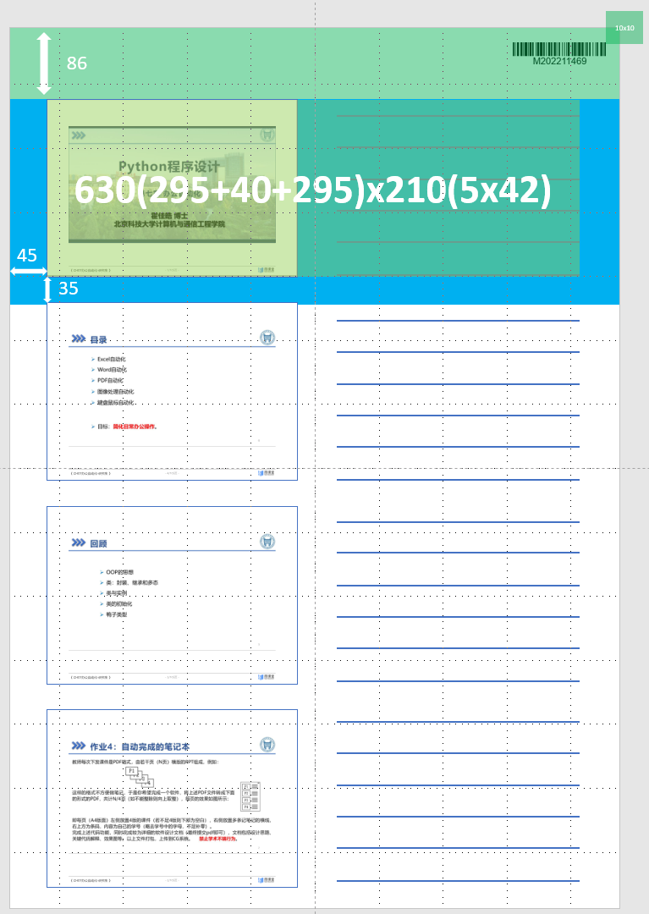
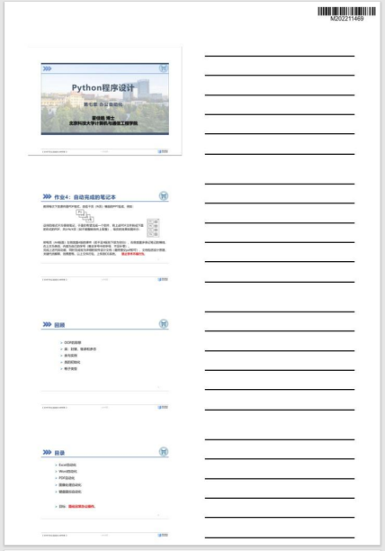

## 设计思路
这是一个固定页面布局的排版系统，因此需要考虑待排版的PDF的页面大小。实现思路如下：

* 对原始的pdf文件的每一页内容以图片形式进行保存，保存时考虑图片的大小缩放以适配排版需要。

* 将原pdf的一页内容作为一个新pdf中的一个模块`block`，每一个block由原本的pdf内容和笔记空行组成。笔记空行以图片形式呈现，因此每一个block以图片+图片的形式存储。页面布局如图所示。

  

* 条码部分调用api并通过requests库保存至`template`文件夹中。

* 根据排版设定绘制所有页面，最终通过`PIL.Image`库实现合并所有图片至一个pdf文件进行输出。


## 关键代码
模块化设计，有几个重要的函数：
* download_banner(id):
该函数用于制作右上方的条形码，参数`id`是需要以条形码展示的内容，该函数通过api调用获取条形码并下载至`template`文件夹中。

* make_page(page_list, output_id):
  该函数用于制作单一页面，输出为`numpy.array`数组。两个参数分别为待制作的原始pdf的页码范围以及输出的新pdf的页面图片文件名。`page_list`中的每一个元素的生成是用`list_generator`实现的：
  ```python
  all_pages = [i for i in range(1,pdfdoc.page_count + 1)]
  pages = [all_pages[i:i+4] for i in range(0,len(all_pages),4)]
  ```
  其中的pages就是所有的`page-list`的集合。
* make_block(img):
用于生成`numpy.array`格式的block。通过多个block的组合可以更灵活地进行页面排版，以应对不足4版则下部为空白的要求。

* make_banner():
该函数用于在空白A4页面中生成右上方的条码，核心逻辑是覆盖空白页码的部分区域。

* make_paper()：
用于生成所有的新pdf页面的图片，并将结果保存至`output`文件夹中。

* mere_pdf():
对`output`文件夹中的文件先进行文件名的升序排序，随后将其按升序排序的结果拼接成新的pdf进行保存。

## 使用方法&运行截图
在`utils.py`中的主函数入口处，修改`in_pdf`和`out_pdf`的名称。前者为待处理的原始pdf文件，后者为输出的pdf文件。运行截图如下：



